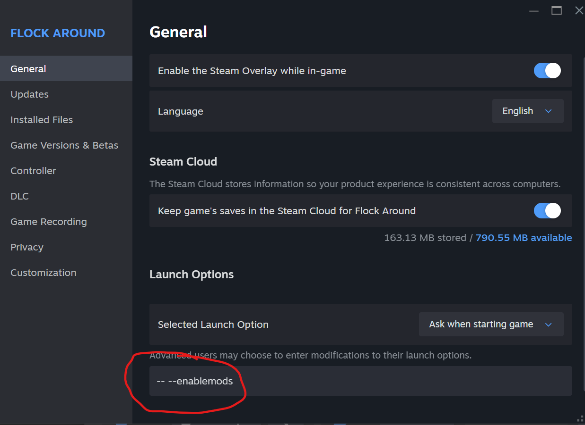

# Getting Started

## Installing Mods

To install mods you must run the game with `-- --enablemods` set in the advanced launch options of your game properties.

## Making Mods

If you want to get started with Flock Around modding, the easiest way to do that is to [watch the playlist](https://www.youtube.com/playlist?list=PLPqVxHA_cBMA). These videos are meant to be watched in order.
